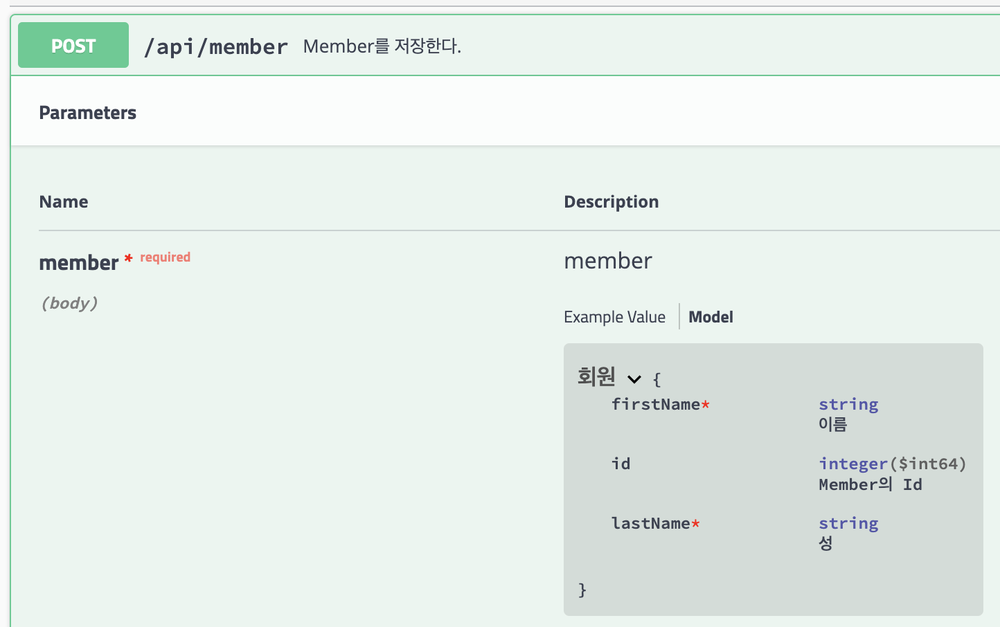
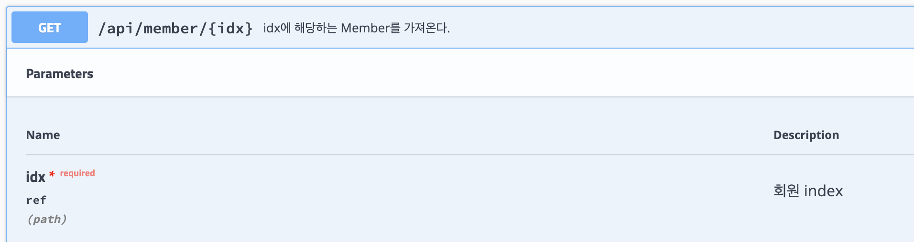

# swagger-example
### Main
Controller단에서, @ApiOperation을 사용하여 API 설명을 적음

### Model
Model단에서, @ApiModel, @ApiModelProperty를 사용하여 Parameter 설명을 적음

### Parameter
Controller단에서, @ApiImplicitParams를 사용하여 GET 방식으로 가져온 Parameter 설명을 적음
